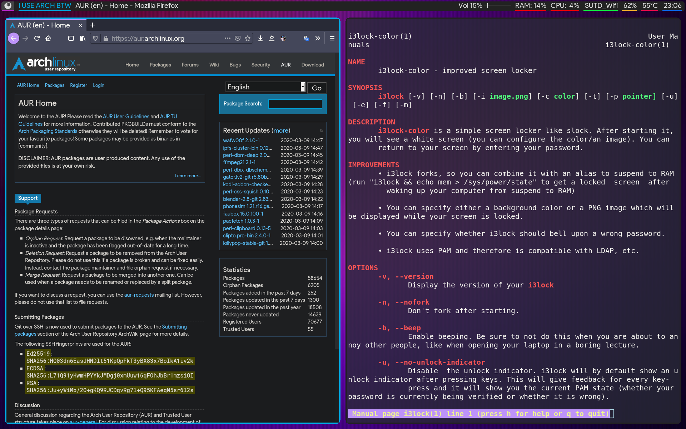
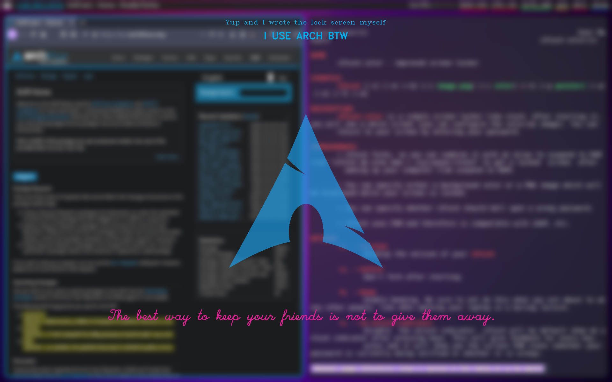

## A custom screensaver with i3lock and OpenCV

This is a Python script that I bind to a hotkey in my system to enable a screensaver of my own preferred style, it blurs my current desktop and add some stylish points and fortune cookies to itself.

### Example

Before lock:

---

After lock:

---

Smoking Sexy Style
